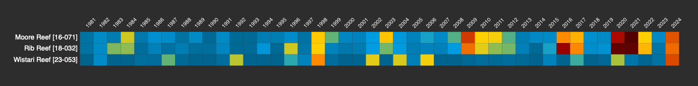

```{r setup, include=FALSE}
knitr::opts_chunk$set(echo = TRUE)
```

## About D^~3~^HW

D^~3~^W is a data visualisation of the annual heatstress (DHW) for each reef on the Great Barrier Reef. Each row represents a reef (4306 reefs in total), each column represents the amount of heat stress experienced (between 1981 and 2025). The colors represent the maximum heat stress in that year: in simple terms, [normal conditions]{style="color: #00A6E5;"}, [coral bleaching conditions]{style="color: #FFD700;"}, [strong coral bleaching conditions]{style="color: #FF8C00;"}, [likely catastrophic bleaching conditions]{style="color: #CC0000;"}.

D^~3~^HW was created using the [D3 library](%22If%20a%20tree%20falls%20in%20a%20forest%20and%20no%20one%20is%20around%20to%20hear%20it,%20does%20it%20make%20a%20sound?%22) in javascript - hence the term D^~3~^ egree Heating Weeks.

## **Why D^~3~^HW?**

Sea Surface Temperature (SST) data is widely accessible from various satellites, but is often hard to visualise. Questions like "*how bad is this year's bleaching compared to last year*?", and "*How many reefs are affected by bleaching*?" are difficult to map due to the size of the Great Barrier Reef, and time-series charts often mask the impacts on individual reefs.

D^~3~^HW aims to i) simplify long-term trends in temperature and climate change on the Great Barrier Reef, and ii) highlight that intense heatwaves on the Great Barrier Reef are a recent phenomena, and not a "normal" state.

## Why the GBR?

The impact of coral bleaching on the Great Barrier Reef takes time to assess through surveys, yet the link between DHW and both coral bleaching and coral mortality are [well](https://www.nature.com/articles/nature21707) [documented](https://peerj.com/articles/7473/) [on](https://www.publish.csiro.au/MF/MF99078) [the](https://www.cell.com/current-biology/fulltext/S0960-9822(21)01490-1) [Great](https://aslopubs.onlinelibrary.wiley.com/doi/full/10.1002/lol2.10456) [Barrier](https://link.springer.com/article/10.1007/s00338-009-0502-z) [Reef](https://www.coralreefwatch.noaa.gov/satellite/analyses_guidance/gbr_heat_stress_event_2020_status_asof20200227.pdf).

Unlike the recent bushfires where the impacts of [climate-change driven heatwaves](https://www.qld.gov.au/emergency/dealing-disasters/disaster-types/bushfires/bushfire-aware/climate-change-and-bushfire) are clearly visible, the recent mass coral bleaching events on the Great Barrier Reef have largely gone by unreported as they unfolded - despite satellite data being readily available in near real-time.

As one journalist put to me recently: "*if a bleaching event is underway on the GBR and no reporting on the temperature data, how can anyone know the size and scale that these events are actually occuring*?"

D^~3~^HW aims to make satellite data more accessible to non-scientific audiences, allowing comparisons between current heat-stress levels with previous events, and facilitating tracking of coral bleaching events as they occur in realtime.

## Reef-level tracking of annual DHW

D^~3~^HW aims to make it easier to visualise time-series of Degree Heating Weeks for any reef on the GBR. For example, comparing Moore Reef (Cairns), Rib Reef (Townsville), and Wistari Reef (southern GBR) highlights how Wistari in the south avoided heatstress for nearly a decade prior to the 2024 mass bleaching event, while Moore Reef and Rib Reef further north have been impacted repeatedly by heatwaves in 2016, 2017, 2020, 2021, 2022, and 2024.



## 

## Datasets used in D^~3~^HW: {.tabset}

### NOAA OISST v2.1

```{r, warning=FALSE, message=FALSE, fig.width=8, fig.height=8}

library(tidyverse)
library(sf)
library(ggplot2)

GBR_DHW_OISST <- read.csv("/Users/rof011/dhw3/data/OISST_DHWmax.csv") |> 
  pivot_longer(
    cols = starts_with("X"),
    names_to = "year",
    values_to = "dhw"
  ) %>%
  mutate(
    year = as.numeric(str_remove(year, "^X"))
  )

dhw_numeric_breaks <- c(0, 3, 6, 9, 12, 15, 18, 21)  # Adjust numeric breaks
dhw_colour_breaks <- c("#006f99", "#00A6E5", "#FFD700", "#FF8C00", "#B20000", "#660000", "#3D0000")


ggplot() + theme_bw() +
  geom_tile(data=GBR_DHW_OISST, aes(x=year, y=lat, fill=dhw), linewidth=0) +
  scale_fill_gradientn(
    limits = c(0, 21),
    name = expression(DHW[max]),
    na.value = "transparent",
    breaks = dhw_numeric_breaks,
    labels = dhw_numeric_breaks,
    colours = dhw_colour_breaks,
    values = scales::rescale(dhw_numeric_breaks, from = c(0, 20))
  ) +
  xlab("Year") + ylab("Latitude") +
  scale_y_continuous(
    expand = c(0, 0),
    breaks = seq(floor(min(GBR_DHW_OISST$lat)), ceiling(max(GBR_DHW_OISST$lat)), length.out = 9),
    labels = seq(floor(min(GBR_DHW_OISST$lat)), ceiling(max(GBR_DHW_OISST$lat)), length.out = 9)
  ) +
   scale_x_continuous(
    expand = c(0, 0),
    limits = c(1980, 2025),
    breaks = seq(1980, 2025, 2),
    sec.axis = dup_axis(name = "Year")
  ) +
  theme(
    # Backgrounds
    plot.background = element_rect(fill = "#333", color = NA),
    panel.background = element_rect(fill = "#333", color = NA),
    panel.grid = element_blank(),
    
    # Axes
    axis.title = element_text(color = "white"),
    axis.text = element_text(color = "white"),
    axis.text.x = element_text(angle = 90, hjust = 1, color = "white"),
    axis.text.y = element_text(color = "white", hjust=-0.2),
    axis.ticks = element_line(color = "white"),
    
    # Secondary axis text and title
    axis.title.x.top = element_text(color = "white"),
    axis.text.x.top = element_text(color = "white"),
    
    # Legend
    legend.background = element_rect(fill = "#333", color = NA),
    legend.key = element_rect(fill = "#333", color = NA),
    legend.text = element_text(color = "white"),
    legend.title = element_text(color = "white"),
    
    # Titles
    plot.title = element_text(color = "white"),
    plot.subtitle = element_text(color = "white"),
    plot.caption = element_text(color = "white")
  )


```

### NOAA CRW v3.1 {.active}

```{r, warning=FALSE, message=FALSE, fig.width=8, fig.height=8}


GBR_DHW_CRW <- read.csv("/Users/rof011/dhw3/data/CRW_DHWmax.csv") |> 
  pivot_longer(
    cols = starts_with("X"),
    names_to = "year",
    values_to = "dhw"
  ) %>%
  mutate(
    year = as.numeric(str_remove(year, "^X"))
  )

dhw_numeric_breaks <- c(0, 3, 6, 9, 12, 15, 18, 21)  # Adjust numeric breaks
dhw_colour_breaks <- c("#006f99", "#00A6E5", "#FFD700", "#FF8C00", "#B20000", "#660000", "#3D0000")


ggplot() + theme_bw() +
  geom_tile(data = GBR_DHW_CRW, aes(x = year, y = lat, fill = dhw), linewidth = 0) +
  scale_fill_gradientn(
    limits = c(0, 21),
    name = expression(DHW[max]),
    na.value = "transparent",
    breaks = dhw_numeric_breaks,
    labels = dhw_numeric_breaks,
    colours = dhw_colour_breaks,
    values = scales::rescale(dhw_numeric_breaks, from = c(0, 20))
  ) +
  xlab("Year") + ylab("Latitude") +
  scale_y_continuous(
    expand = c(0, 0),
    breaks = seq(floor(min(GBR_DHW_CRW$lat)), ceiling(max(GBR_DHW_CRW$lat)), length.out = 9),
    labels = seq(floor(min(GBR_DHW_CRW$lat)), ceiling(max(GBR_DHW_CRW$lat)), length.out = 9)
  ) +
   scale_x_continuous(
    expand = c(0, 0),
    limits = c(1980, 2025),
    breaks = seq(1980, 2025, 2),
    sec.axis = dup_axis(name = "Year")
  ) +
  theme(
    # Backgrounds
    plot.background = element_rect(fill = "#333", color = NA),
    panel.background = element_rect(fill = "#333", color = NA),
    panel.grid = element_blank(),
    
    # Axes
    axis.title = element_text(color = "white"),
    axis.text = element_text(color = "white"),
    axis.text.x = element_text(angle = 90, hjust = 1, color = "white"),
    axis.text.y = element_text(color = "white", hjust=-0.2),
    axis.ticks = element_line(color = "white"),
    
    # Secondary axis text and title
    axis.title.x.top = element_text(color = "white"),
    axis.text.x.top = element_text(color = "white"),
    
    # Legend
    legend.background = element_rect(fill = "#333", color = NA),
    legend.key = element_rect(fill = "#333", color = NA),
    legend.text = element_text(color = "white"),
    legend.title = element_text(color = "white"),
    
    # Titles
    plot.title = element_text(color = "white"),
    plot.subtitle = element_text(color = "white"),
    plot.caption = element_text(color = "white")
  )

```

### ECMWF ERA5 v5

```{r,warning=FALSE, message=FALSE, fig.width=8, fig.height=8}


GBR_DHW_ERA5 <- read.csv("/Users/rof011/dhw3/data/ERA5_DHWmax.csv") |> 
  pivot_longer(
    cols = starts_with("X"),
    names_to = "year",
    values_to = "dhw"
  ) %>%
  mutate(
    year = as.numeric(str_remove(year, "^X"))
  )

dhw_numeric_breaks <- c(0, 3, 6, 9, 12, 15, 18, 21)  # Adjust numeric breaks
dhw_colour_breaks <- c("#006f99", "#00A6E5", "#FFD700", "#FF8C00", "#B20000", "#660000", "#3D0000")


ggplot() + theme_bw() +
  geom_tile(data=GBR_DHW_ERA5, aes(x=year, y=lat, fill=dhw), linewidth=0) +
  scale_fill_gradientn(
    limits = c(0, 21),
    name = expression(DHW[max]),
    na.value = "transparent",
    breaks = dhw_numeric_breaks,
    labels = dhw_numeric_breaks,
    colours = dhw_colour_breaks,
    values = scales::rescale(dhw_numeric_breaks, from = c(0, 20))
  ) +
  xlab("Year") + ylab("Latitude") +
  scale_y_continuous(
    expand = c(0, 0),
    breaks = seq(floor(min(GBR_DHW_ERA5$lat)), ceiling(max(GBR_DHW_ERA5$lat)), length.out = 9),
    labels = seq(floor(min(GBR_DHW_ERA5$lat)), ceiling(max(GBR_DHW_ERA5$lat)), length.out = 9)
  ) + 
  scale_x_continuous(
    expand = c(0, 0),
    limits = c(1980, 2025),
    breaks = seq(1980, 2025, 2),
    sec.axis = dup_axis(name = "Year")
  ) +
  theme(
    # Backgrounds
    plot.background = element_rect(fill = "#333", color = NA),
    panel.background = element_rect(fill = "#333", color = NA),
    panel.grid = element_blank(),
    
    # Axes
    axis.title = element_text(color = "white"),
    axis.text = element_text(color = "white"),
    axis.text.x = element_text(angle = 90, hjust = 1, color = "white"),
    axis.text.y = element_text(color = "white", hjust=-0.2),
    axis.ticks = element_line(color = "white"),
    
    # Secondary axis text and title
    axis.title.x.top = element_text(color = "white"),
    axis.text.x.top = element_text(color = "white"),
    
    # Legend
    legend.background = element_rect(fill = "#333", color = NA),
    legend.key = element_rect(fill = "#333", color = NA),
    legend.text = element_text(color = "white"),
    legend.title = element_text(color = "white"),
    
    # Titles
    plot.title = element_text(color = "white"),
    plot.subtitle = element_text(color = "white"),
    plot.caption = element_text(color = "white")
  ) 


```

## D^~3~^HW Codebase

D^~3~^W was created using the [D3 library](%22If%20a%20tree%20falls%20in%20a%20forest%20and%20no%20one%20is%20around%20to%20hear%20it,%20does%20it%20make%20a%20sound?%22) in javascript. All code for downloading and extracting the data via the [`dhw`](https://github.com/marine-ecologist/dhw/) package in R and visualisation in `.js` available at [GitHub](http://github.com/marine-ecologist/dhw3/). D^~3~^W was mostly written as a learning curve for javascript - Feel free to add comments or improve!
